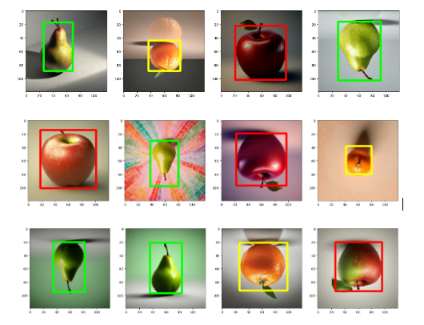

# Detector de fruites amb intel·ligència artificial

Aquest projecte utilitza tècniques d'intel·ligència artificial per detectar i classificar fruites, amb un enfocament específic en pomes, peres i mandarines. La implementació es basa en xarxes neuronals profundes per al processament d'imatges i aprenentatge automàtic.

## Taula de continguts

- [Abstract](#Abstract)
- [Resultats en consola](#Resultats_en_consola)
- [Autors](#Autors)

## Abstract
This research focuses on the study of Artificial Intelligence (AI) and its application to object recognition. AI is playing an increasingly important role in today's society, changing the way we live and work. Moreover, this world is constantly evolving over time, creating a great curiosity to explore and understand AI. 

This work is a thorough exploration of the functioning and presence of AI in our world. In addition to this theoretical overview, it includes a case study with the creation and development of an AI with object recognition capabilities, specifically fruit identification. 

To develop this AI, advanced programming with Python was used, relying on deep learning method with a convolutional neural network, as well as other fundamental elements such as libraries and data to make its creation possible.

The main result of this work has been, on the one hand, to develop the AI and verify its operation with real examples and, on the other hand, to lay the foundations for future developments and practical applications to be used in future projects.

## Resultats en consola

## Autors
- Ferran Òdena
- Gússem Yahia-Cheikh

